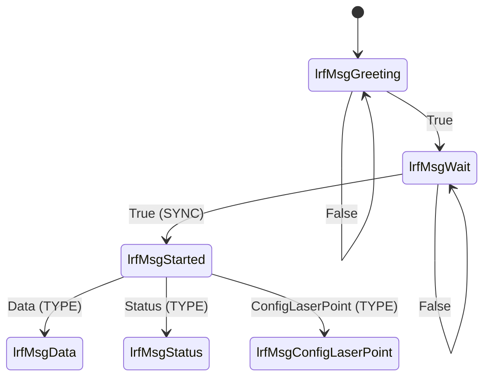

# Receive function

1. Turn on LRF by enable Power (POWER_EN pin)
2. Waiting the greeting message such as b'\n\rLRF127-M4       2.4.25.2\r\n'
3. Waiting the message: check the first byte if it is SYNC (0x59)
4. Move to different TYPE handler by the second byte

## state diagram
